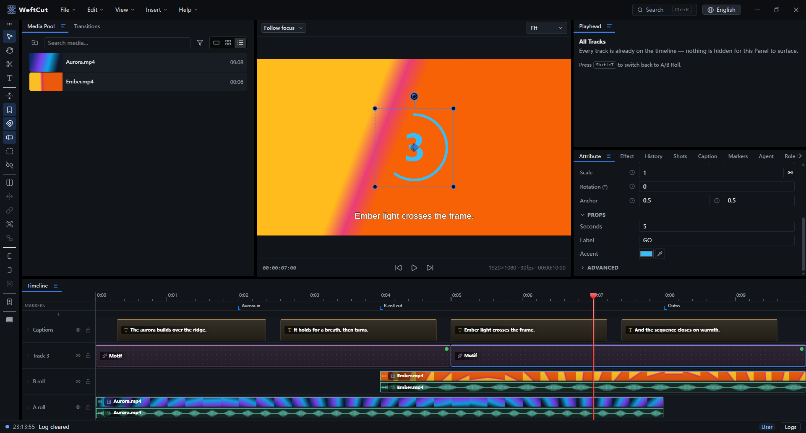
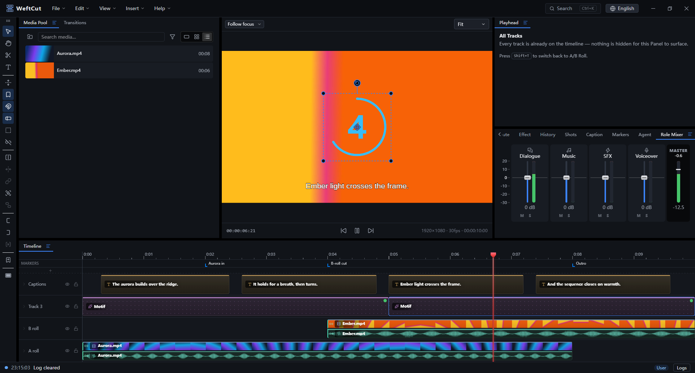

<p align="center">
  
</p>

<h1 align="center">WeftCut</h1>

<p align="center">
  <strong>The video editor your AI agent can drive like you do.</strong><br/>
  Point Codex, Claude, or any MCP client at a real desktop NLE — and watch
  every edit land on your timeline while it plays. Code renders as video, so
  your agent can build editable clips.
</p>

> [!NOTE]
> WeftCut is still under active development, so some features and UI/UX may change before v1.0.0. Join us to improve the project!

<p align="center">
  <a href="https://github.com/WeftCut/WeftCut/releases/latest"></a>
  
  <a href="LICENSE"></a>
  <a href="https://glama.ai/mcp/servers/WeftCut/WeftCut"></a>
</p>


<p align="center"><em>An agent works over MCP while playback runs: restyling the
lower third, trimming the B-roll, then undoing both — every edit lands in the UI
in real time, every Agent action is recorded.</em></p>

Most editors bolt AI on as a feature: a button that generates something, a sidebar that suggests a cut. WeftCut exposes the editor *itself* as a tool surface. A localhost MCP server publishes **all editing tools** — place, trim, split, restyle, keyframe, group, caption, mix, checkpoint — and whatever agent you already have open drives them. The intelligence lives outside the app: the installer bundles no model weights, and the local engines for speech and vision are an opt-in download when you want them.

None of that rides on a stripped-down editor. Everything an agent can reach, you can do by hand, in a full NLE: A/B-roll timeline, keyframes with a curve editor, effects, captions, a role-based audio mixer, and hardware-accelerated export.

## Quick start

> [!NOTE]
>
> We don't have a verified macOS installer yet, so allow it under **System Settings → Privacy & Security → Open Anyway**

1. Download the installer for your platform from the [releases page](https://github.com/WeftCut/WeftCut/releases/latest).
2. Install the app, open the settings panel, and copy the prompt that teaches your agent how to connect to WeftCut.
3. Enjoy your work.

## Hand your timeline to an agent

Copy the prompt in settings into your client, and your agent is holding the editor.

- **It edits the project you are watching.** No import/export round trip, no separate headless copy.
- **You can always see what it did.** Every tool call becomes a row in the Agent panel — *Trimmed clip · Ember.mp4*, *Added marker · Needs a look* — and the status bar echoes it. Nothing happens off the record.
- **Every batch is reversible.** Agents checkpoint at logical boundaries, and each checkpoint is one click from being restored. The agent can also rehearse a whole multi-step edit against a throwaway clone first (`dry_run`) and find the collision before it touches your project.
- **Multi-agent, with rules.** Sessions are per-connection. An agent that is mid-batch can `set_history_lock` so a stray Ctrl-Z doesn't land in the middle of its work — and the lock, plus the reason it gave, is shown to you.

For a longer run, an agent can call `begin_agent_session` and fold the UI down to preview, scrub, and a record of what it is doing:


## Code as video: Motifs

A **Motif** is an on-screen element written as code — a real web page (HTML, CSS, SVG, canvas, WebGL, whatever you reach for) dropped on the timeline as a layer. It isn't a fixed preset: the author declares the knobs, and the inspector builds the form from that declaration, so `seconds`, `label` and `accent` below are editable in the app.

The one rule that makes it an editor feature instead of a screen recording: **a Motif renders as a pure function of time.** It never advances itself. The harness owns the clock and drives the page to each composition frame, so the same `t` always yields the same pixels — when you scrub, when you re-export, and in preview and export alike.

```js
// The built-in Countdown's whole script, near enough verbatim — the rest of the
// file is the SVG ring it animates. `props` is whatever the manifest declares;
// `frame` runs once per composition frame and keeps no state of its own.
motif.define({
  setup: async function (props, ctx) {
    _label = props.label != null ? String(props.label) : "GO";
    num.style.color = props.accent;
    ring.style.stroke = props.accent;
    ring.setAttribute("stroke-dasharray", C);
    ring.animate([{ strokeDashoffset: 0 }, { strokeDashoffset: C }],
      { duration: ctx.duration * 1000, easing: "linear", fill: "both" });
  },
  frame: function (t, ctx) {
    var n = Math.max(0, Math.ceil(ctx.duration - t));
    num.textContent = n > 0 ? String(n) : _label;
  },
});
```



Writing a web page is the thing coding agents are already best at — so an agent can author a brand-new overlay for your edit instead of picking one from a catalog. The authoring spec ships inside the app as an agent skill, so the model gets the contract without you pasting documentation.

Lower thirds, countdowns, karaoke text and animated title cards are the obvious uses. Anything you can build on a page is the actual limit.

## A complete editor underneath


**Timeline** — A/B-roll rows with filmstrips and waveforms, frame-accurate SMPTE editing, ripple delete that closes the gap behind it, linked A/V that trims as one clip, cross-track groups, and nested compositions.
<br/><sub>Agent: `move_layer` · `trim_layer` · `split_layer` · `ripple_delete_gap` · `create_link` · `create_group` · `move_layers_to_composition`</sub>

**Keyframes** — animate any parameter, with bézier easing, a curve editor, tangent control, motion paths and extrapolation.
<br/><sub>Agent: `set_keyframe` · `update_keyframe` · `smooth_keyframes` · `set_extrapolation`</sub>

**Speech and captions** — transcribe a clip and get editable caption layers packed onto your caption tracks; import SRT/VTT/ASS the same way. Transcription runs against a cloud provider, or entirely on your machine once you let the app fetch a local engine (whisper.cpp, FunASR) — or an agent can pull the raw audio out and run its own model. Text-to-speech for scratch voiceover.
<br/><sub>Agent: `transcribe_clip` · `extract_clip_audio` · `apply_subtitles` · `synthesize_speech`</sub>

**Audio** — role-based mixing (dialogue / music / SFX / voiceover) with live per-role metering, gain, pan, fades and denoise. **Pauses** finds the dead air in a take and cuts it as one undoable edit, keeping a pad so speech still breathes.
<br/><sub>Agent: `detect_pauses` · `remove_pauses` · `set_role_gain` · `set_role_flags`</sub>



**Understanding the footage** — shot-boundary detection with per-shot brightness, motion and sharpness, frame comparison, and vision-model descriptions of what a clip actually contains. An agent can cut on content, not just on timecode.
<br/><sub>Agent: `analyze_clip` · `auto_split_by_shot` · `describe_clip` · `compare_frames`</sub>

**Titles, effects and transitions** — styled text layers with outlines, per-layer effect chains including chroma key with an eyedropper that picks from the live frame, and transitions between clips.
<br/><sub>Agent: `add_effect` · `update_effect` · `add_transition` · `update_transition`</sub>

**Export** — H.264 / HEVC / AV1, hardware or software encoders, resolution / fps / quality controls, and streamed muxing.

**Find anything** — one `Ctrl+K` palette over commands, media, clips, captions and markers, search for whatever you want.


## Tech stack

| Layer | Stack |
|---|---|
| **Shell** | Electron 44 · TypeScript 7 · electron-vite · Vite 8 · Node 24 |
| **UI** | React 19 · Zustand · Immer · Tailwind CSS v4 · Base UI · shadcn/ui · Dockview · lucide · i18next (`en-US` / `zh-CN`) · fuzzysort |
| **Preview** | PixiJS v8 · WebGPU / WebGL · WebCodecs `VideoDecoder` pool · mediabunny · own YUV→RGB shaders · Web Audio clock |
| **Export** | Worker + `OffscreenCanvas` · GPU YUV pack pass · PBO readback · rawvideo over IPC · native ffmpeg sink · WebCodecs encoder (pin) · stream-copy mux |
| **Native core** | Rust · napi-rs 3 · Tokio · imbl · serde · schemars · blake3 · reqwest · ffmpeg-sidecar |
| **Native decode** | `@weftcut/native-decode` · ffmpeg-next · software + GPU lanes · `sharedTexture` (Windows) |
| **Shared math** | `weftcut-eval` crate · native + wasm32 · snap · keyframe eval · envelope · role gate |
| **ffmpeg** | GPL CLI sidecar (jobs, encode, mux) · LGPL shared libs (in-process decode) |
| **Agent surface** | MCP · streamable HTTP on localhost · `@modelcontextprotocol/sdk` · bearer token · TS + Rust tool catalog |
| **Motifs** | Offscreen BrowserWindow · Chrome DevTools Protocol · `motif:` scheme · CSP `default-src 'none'` |
| **Speech & vision** | Cloud providers over reqwest · whisper.cpp · FunASR · on-demand model download |
| **Tests & CI** | Vitest · cargo test · Playwright · `node --test` · Stryker · GitHub Actions (Windows / macOS / Linux) |

Design decisions: [ADRs](docs/adr/).

## Build from source

Prerequisites: **Node 24+**, **Rust** (stable via `rustup`), and your platform's C++ build tools — per-OS commands in [docs/setup.md](docs/setup.md).

```sh
npm install       # JS dependencies
npm run bootstrap # one-time: fetch ffmpeg + build the Rust addons
npm run dev       # start the editor
```

Also useful: `npm run typecheck`, `npm test`, `npm run e2e`, `npm run build`, `npm run package` (installers).

## Documentation

Start with **[architecture](docs/architecture.md)** for the system map, or **[MCP server & agent UX](docs/mcp.md)** for the tool surface, resources and multi-agent behavior. **[Motifs](docs/motifs.md)** and **[motif authoring](docs/motif-authoring.md)** cover the overlay engine and its contract.

<details>
<summary>Everything else</summary>

- **[Data model](docs/data-model.md)** — project state schema, history, persistence, validation.
- **[Render](docs/render.md)** — PixiJS + WebCodecs renderer architecture.
- **[Preview](docs/preview.md)** — interactive preview surface and transport.
- **[Export](docs/export.md)** — export settings and range, audio export, final mux, proxies, background jobs.
- **[Captions](docs/captions.md)** · **[Audio](docs/audio.md)** — caption ingestion and the audio engine.
- **[Conformance](docs/conformance.md)** — media fixtures and E2E gates for frame alignment, audio sync, colour.
- **[Features](docs/features.md)** — small-feature contracts: undo-stack scope, groups, search palette, colour picker.
- **[Status / log system](docs/status-log.md)** — the bottom-of-editor log bus.
- **[Setup](docs/setup.md)** — per-OS toolchain prerequisites and first-run flow.
- **[Licensing](docs/licensing.md)** — MIT app plus the two FFmpeg lanes and their build-time compliance gates.
- **[v1 target](https://github.com/WeftCut/WeftCut/issues/11)** — release scope and open work, tracked as an issue: `docs/` describes what exists today.

</details>

## Maintainer

WeftCut is built and maintained by [UncleChair](https://github.com/UncleChair).

It exists to speed up my own video work. I wanted an editor an agent could actually drive, and a timeline I could keep watching while it did — so the MCP surface is the part I use daily, not a demo bolted onto the side. Motifs came from the other half of that: the overlays I wanted were easier to *write* than to find, and an agent that can write a web page can write one for the shot in front of it.

The project sits under the [WeftCut](https://github.com/WeftCut) organization so the name, domain and releases have a stable home, but it is a one-person project — issues and pull requests all reach me.

## License

WeftCut is licensed under the [MIT License](LICENSE). Packaged installers bundle FFmpeg binaries under their own licenses (LGPL shared libraries for in-process decode, GPL command-line tools run as a separate process) — see [THIRD-PARTY-NOTICES.md](THIRD-PARTY-NOTICES.md) and [docs/licensing.md](docs/licensing.md) for the full model.
