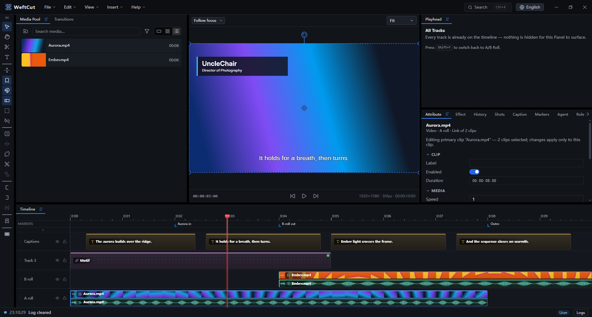
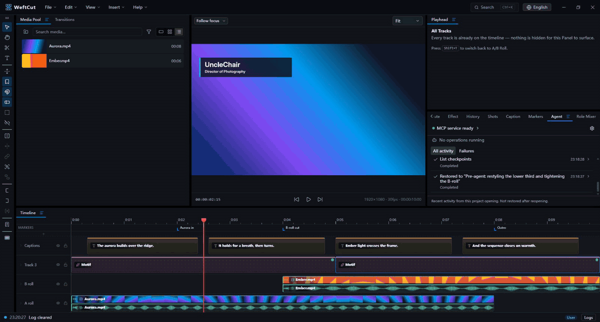
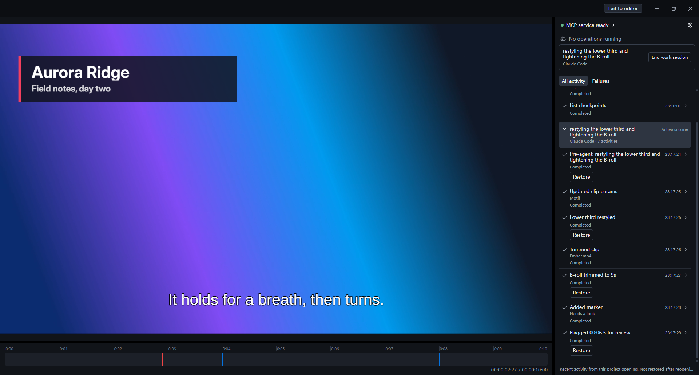
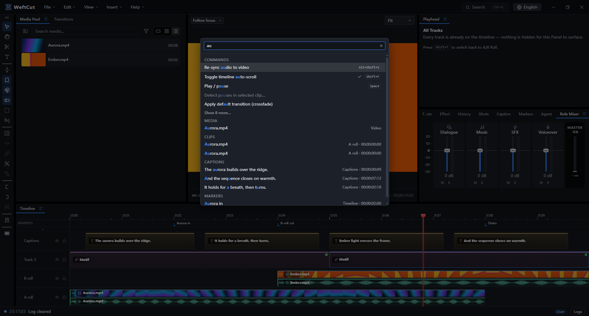

<p align="center">
  
</p>

<h1 align="center">WeftCut</h1>

<p align="center">
  A cross-platform desktop video editor where <strong>AI agents are first-class citizens</strong>.<br/>
  Connect Claude, Cursor, or any MCP client — and audit its edits to your timeline live.
</p>




Most editors bolt AI on as features. WeftCut exposes the editor *as* a tool
surface: a localhost MCP server with a full catalog of editing tools, driven by
whatever agent you connect. The intelligence lives outside; the app stays
small, fast, and free of bundled models. Everything an agent can do, you can
do — it is also a complete editor for humans.



<p align="center"><em>An agent at work over MCP while playback runs: restyling the
lower third live, trimming the B-roll, then undoing — every edit lands in the UI
in real time.</em></p>

For a longer run, an agent can put the editor into **agent mode**: the UI folds
down to preview, scrub and a record of what the agent is doing, and every batch
boundary it checkpoints is one click away from being restored.



## Features

- **Agent-native editing** — a built-in MCP server (streamable HTTP) exposes
  the whole editor: place and trim clips, restyle titles, set keyframes,
  manage groups and markers, checkpoint and undo. Changes land in the UI in
  real time while you keep editing alongside.
- **A real NLE timeline** — A/B-roll rows with filmstrips and waveforms,
  frame-aligned editing (SMPTE timecode), keyframes with bézier easing and a
  curve editor, cross-track groups with auto-paired audio/video.
- **Fast, accurate preview** — PixiJS v8 + WebCodecs compositing with a native
  Rust decode engine underneath; optional proxies for heavy codecs; a
  transport indicator that tells you when playback drops frames.
- **Titles, captions & Motifs** — styled text layers; SRT/VTT/ASS import as
  editable caption layers; "Motifs": animated, parameterized web overlays
  (lower thirds, countdowns, karaoke text) rendered pixel-identically in
  preview and export.
- **Effects** — per-layer effect chains including chroma key, with an
  eyedropper that picks from the live frame.
- **Audio** — role-based mixing (dialogue / music / effects), gain, pan,
  fades, and sample-accurate export through a Rust mixer.
- **Export** — H.264 / HEVC / AV1 up to 10-bit, hardware or software
  encoders, resolution/fps/quality controls, streamed muxing that doesn't
  buffer the whole render in memory.
- **Find anything** — a `Ctrl+K` palette that searches commands, media,
  clips, captions, and markers (with pinyin support).



## How it's built

| Layer | Choice |
|---|---|
| Shell | Electron; UI in React 19 |
| Renderer | PixiJS v8 + WebCodecs — preview on `<canvas>`, export in a Worker on `OffscreenCanvas` |
| Native core | Rust via napi-rs — decode engine, audio mixer, jobs, media analysis |
| Encode / conform | ffmpeg (LGPL libraries in-process for decode; GPL CLI as a separate process for encode) |
| Containers | `mediabunny` (MP4/MOV + Matroska/WebM demux/mux) |
| Agent protocol | MCP over streamable HTTP (`@modelcontextprotocol/sdk`) |

## Getting started

Prerequisites: **Node 22+**, **Rust** (stable via `rustup`), and your
platform's C++ build tools — per-OS install commands in
[docs/setup.md](docs/setup.md).

```sh
npm install       # JS dependencies
npm run bootstrap # one-time: fetch ffmpeg + build the Rust addons
npm run dev       # start the editor
```

Common scripts: `npm run typecheck`, `npm test`, `npm run e2e`,
`npm run build`, `npm run package` (installers). See
[docs/setup.md](docs/setup.md) for packaging notes and troubleshooting.

To connect an agent, grab the MCP URL + token the app prints on startup (also
available in-app) and drop it into your client's MCP config — the full tool
surface and multi-agent behavior are documented in [docs/mcp.md](docs/mcp.md).

## Documentation

- **[Architecture](docs/architecture.md)** — system overview, components, data flow, repo layout.
- **[Data model](docs/data-model.md)** — project state schema, history, persistence, validation.
- **[Render](docs/render.md)** — PixiJS + WebCodecs renderer architecture.
- **[Motifs](docs/motifs.md)** — parameterized web overlays (CDP capture, raster cache, user-authored catalog).
- **[Preview](docs/preview.md)** — interactive preview surface and transport.
- **[Export](docs/export.md)** — export settings + range, audio export, final mux, proxies and background jobs.
- **[Conformance](docs/conformance.md)** — media fixtures and E2E gates for frame alignment, audio sync, and color.
- **[MCP server & agent UX](docs/mcp.md)** — protocol, tool surface, resources, multi-agent.
- **[Features](docs/features.md)** — small-feature contracts: undo-stack scope, groups, the search palette, the color picker.
- **[Status / Log system](docs/status-log.md)** — bottom-of-editor log bus.
- **[Setup](docs/setup.md)** — per-OS toolchain prerequisites and first-run flow.
- **[Licensing](docs/licensing.md)** — MIT app + the two FFmpeg lanes (LGPL in-process decode, GPL sidecar) and their build-time compliance gates.
- **[v1 target](https://github.com/WeftCut/WeftCut/issues/11)** — release scope and open work. Tracked as a GitHub issue, not a doc: `docs/` describes what exists today.
- **ADRs** — [`docs/adr/`](docs/adr/): architecture decision records with a `status` frontmatter field (`accepted`, `proposed`, or `superseded`). Prefer the top-level docs above for current behavior; older ADRs may be historical.

## License

WeftCut is licensed under the [MIT License](LICENSE). Packaged installers
bundle FFmpeg binaries under their own licenses (LGPL shared libraries for
in-process decode, GPL command-line tools run as a separate process) — see
[THIRD-PARTY-NOTICES.md](THIRD-PARTY-NOTICES.md) and
[docs/licensing.md](docs/licensing.md) for the full model.
